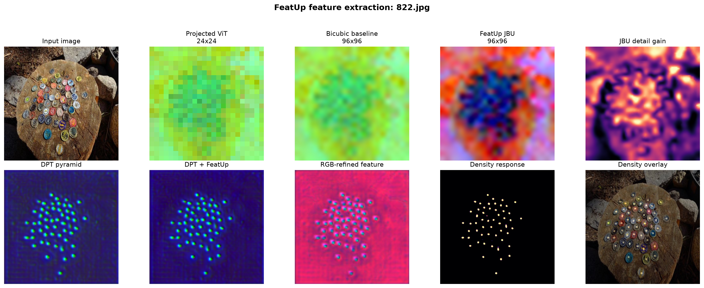
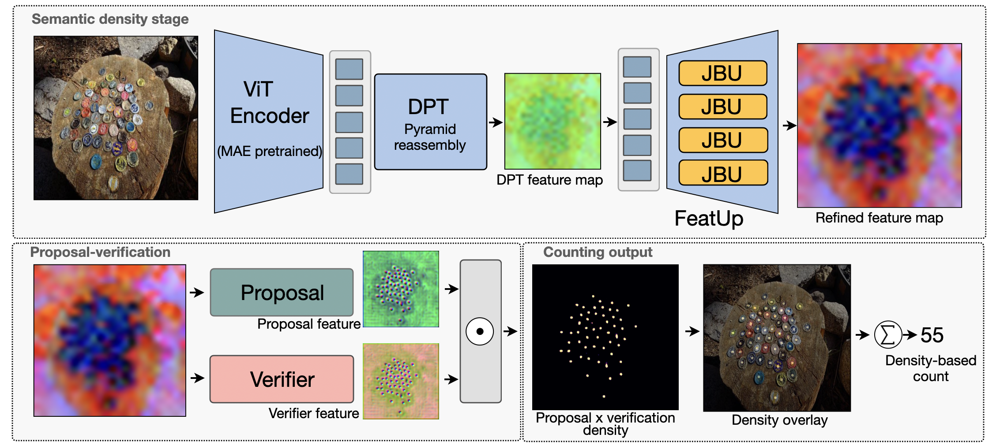
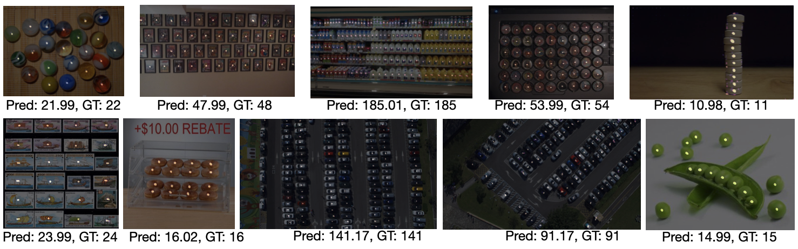
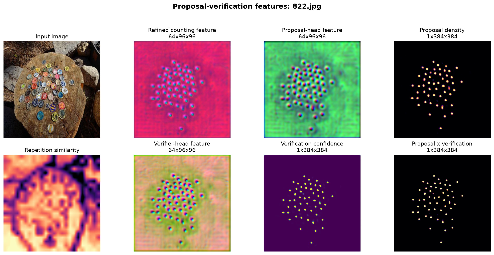

# UPCount

Reference-free, spatially aware, class-agnostic object counting with an
MAE-pretrained ViT, DPT-style feature reassembly, FeatUp-style joint bilateral
upsampling, and proposal verification.



UPCount takes only an RGB image at inference time. It does **not** require
exemplar boxes, text prompts, or non-maximum suppression. The model returns a
full-resolution density map; its integral (divided by the dataset density
scale) is the predicted count.

Full paper is available on [arXiv](https://arxiv.org/abs/2607.16826).

## Contents

- [Model overview](#model-overview)
- [Preparation](#preparation)
- [Training](#training)
- [Inference](#inference)
- [Pretrained and fine-tuned weights](#pretrained-and-fine-tuned-weights)
- [Evaluation](#evaluation)
- [Visualization](#visualization)
- [Results](#results)
- [Acknowledgements](#acknowledgements)

## Model overview



The model uses 384 x 384 training crops, a class-token-free
ViT-B/16, intermediate blocks `[2, 5, 8, 11]`, and a 64-channel stride-four
refined feature map. FeatUp-style JBU restores image-aligned detail before the
proposal and verification heads.

## Preparation

### 1. Environment

The tested environment is Python 3.11, PyTorch 2.5.1, torchvision 0.20.1, and
CUDA 12.1. Install a PyTorch build appropriate for your system first:

```bash
conda create -n upcount python=3.11 -y
conda activate upcount

# Example for CUDA 12.1. See pytorch.org for other platforms.
pip install torch==2.5.1 torchvision==0.20.1 \
  --index-url https://download.pytorch.org/whl/cu121
pip install -r requirements.txt
```

Verify the installation without downloading any model weights:

```bash
python -m pytest -q tests
```

### 2. FSC-147

Download FSC-147 from the
[official repository](https://github.com/cvlab-stonybrook/LearningToCountEverything)
and arrange the CounTR-compatible 384-pixel data as follows:

```text
data/FSC147/
├── images_384_VarV2/
├── gt_density_map_adaptive_384_VarV2/
├── annotation_FSC147_384.json
├── Train_Test_Val_FSC_147.json
└── ImageClasses_FSC147.txt
```

`FSC-147-D.json` is included because the legacy data loader reads it, although
v6 itself is image-only and does not use the descriptions.

### 3. CARPK

The data loader expects one manifest and an image directory per split:

```text
data/CARPK/
├── train/
│   ├── images/
│   └── manifest.json
└── test/
    ├── images/
    └── manifest.json
```

One convenient preparation route is the public Deep Lake mirror:

```bash
pip install "deeplake<4"
python prepare_carpk.py --uri hub://activeloop/carpk-train \
  --split train --output_dir data/CARPK/train
python prepare_carpk.py --uri hub://activeloop/carpk-test \
  --split test --output_dir data/CARPK/test
```

See [data/README.md](data/README.md) for the manifest schema and data notes.

## Training

Training follows the CounTR-length two-stage FSC-147 schedule, followed by
optional CARPK fine-tuning. Learning rates are linearly scaled as
`base_lr * effective_batch_size / 256`, with AdamW and cosine decay.

| Stage | Epochs | Batch | Base LR | Single-GPU LR | Warm-up | Weight decay |
|---|---:|---:|---:|---:|---:|---:|
| FSC-147 MAE pretraining | 500 | 8 | 1.5e-4 | 4.6875e-6 | 10 | 0.05 |
| FSC-147 counting fine-tuning | 1000 | 26 | 2.0e-4 | 2.03125e-5 | 10 | 0.05 |
| CARPK counting fine-tuning | 1000 | 8 | 2.0e-4 | 6.25e-6 | 10 | 0.05 |

The shell wrappers expose paths as environment variables and preserve all
command-line arguments for advanced use.

### Stage 1: MAE pretraining on FSC-147

```bash
DATA_ROOT=data/FSC147 \
OUTPUT_DIR=outputs/fsc147-mae-pretrain \
bash scripts/pretrain_fsc147.sh
```

### Stage 2: FSC-147 counting fine-tuning

```bash
DATA_ROOT=data/FSC147 \
MAE_CHECKPOINT=outputs/fsc147-mae-pretrain/checkpoint-last.pth \
OUTPUT_DIR=outputs/fsc147-finetune \
bash scripts/finetune_fsc147.sh
```

The lowest validation MAE is selected automatically and recorded in
`best_checkpoint.json`.

### CARPK fine-tuning

Fine-tune from the best FSC-147 counter:

```bash
DATA_ROOT=data/CARPK/train \
INIT_CHECKPOINT=weights/upcount_fsc147_best_epoch432.pth \
OUTPUT_DIR=outputs/carpk-finetune \
bash scripts/finetune_carpk.sh
```

The CARPK Test split is never used for optimization or checkpoint selection.

## Inference

Run reference-free counting on any RGB image:

```bash
python inference.py \
  --image path/to/image.jpg \
  --checkpoint weights/upcount_fsc147_best_epoch432.pth \
  --output_dir outputs/demo
```

The command writes four independent files:

```text
outputs/demo/
├── source.png
├── predicted_density.png
├── density_overlay.png
└── prediction.json
```

Large images are processed with overlapping 384 x 384 windows and uniform
overlap averaging. Use `--device cpu` for CPU inference or tune
`--window_stride` to trade speed for overlap.

## Pretrained and fine-tuned weights

| Checkpoint | Size | Google Drive |
|---|---:|---|
| FSC-147 MAE epoch 500 | 429 MiB | [Open](https://drive.google.com/file/d/152V-X1mfuCa5yezhJorrojaTN-aS1Imw/view) |
| FSC-147 best epoch 432 | 349 MiB | [Open](https://drive.google.com/file/d/1hrW9wpwkuu9lxwov4MHTs4fXoEPoqu7y/view) |
| CARPK best epoch 816 | 349 MiB | [Open](https://drive.google.com/file/d/1kHqOncgDq9n6rGVntklhqXa24g_OkSK7/view) |

```bash
python scripts/download_weights.py --all
```

## Evaluation

### FSC-147 Val and Test

```bash
DATA_ROOT=data/FSC147 \
CHECKPOINT=weights/upcount_fsc147_best_epoch432.pth \
SPLIT=val bash scripts/evaluate_fsc147.sh

DATA_ROOT=data/FSC147 \
CHECKPOINT=weights/upcount_fsc147_best_epoch432.pth \
SPLIT=test bash scripts/evaluate_fsc147.sh
```

### CARPK Test

```bash
DATA_ROOT=data/CARPK/test \
CHECKPOINT=weights/upcount_carpk_best_epoch816.pth \
bash scripts/evaluate_carpk.sh
```

## Visualization

### Qualitative counting results

The following FSC-147 and CARPK examples show the predicted count and
ground-truth count beneath each image. These cases illustrate the model's
reference-free behavior across different object categories, scales, densities,
and scene layouts.



### Internal feature visualization

Export the internal ViT, DPT, FeatUp/JBU, repetition, proposal, verifier, and
density features for one or more images:

```bash
python export_featup_features.py path/to/first.jpg path/to/second.jpg \
  --resume weights/upcount_fsc147_best_epoch432.pth \
  --output_dir outputs/features
```

The exporter saves every component as an individual PNG and also creates
publication-style summary panels.

### FeatUp refinement


### Proposal and verification



## Results

All numbers below use the complete official evaluation splits and strict
checkpoint loading.

| Dataset | Split | Images | MAE | RMSE |
|---|---|---:|---:|---:|
| FSC-147 | Val | 1,286 | 13.62 | 60.07 |
| FSC-147 | Test | 1,190 | 12.39 | 100.89 |
| CARPK | Test | 459 | 6.27 | 8.79 |

## Acknowledgements

This repository builds on ideas and implementation conventions from:

- [CounTR](https://github.com/Verg-Avesta/CounTR), for the MAE-pretrained
  vanilla ViT encoder and long-horizon counting training protocol.
- [DPT](https://github.com/isl-org/DPT), for multi-level transformer feature
  reassembly into a spatial pyramid.
- [FeatUp](https://github.com/mhamilton723/FeatUp), for learned, image-guided
  feature upsampling.

We also thank the FSC-147 and CARPK authors for making their datasets and
evaluation protocols available.

## Citation

```
@misc{wijaya2026spatiallyawareclassagnosticobjectcounting,
      title={Spatially-Aware Class-Agnostic Object Counting}, 
      author={Robert Wijaya and Md. Tanvir Hossain and Amanda Kau and Ngai-Man Cheung},
      year={2026},
      eprint={2607.16826},
      archivePrefix={arXiv},
      primaryClass={cs.CV},
      url={https://arxiv.org/abs/2607.16826}, 
}
```


## License

Released under the [MIT License](LICENSE). Dataset and third-party model assets
remain subject to their original licenses.
